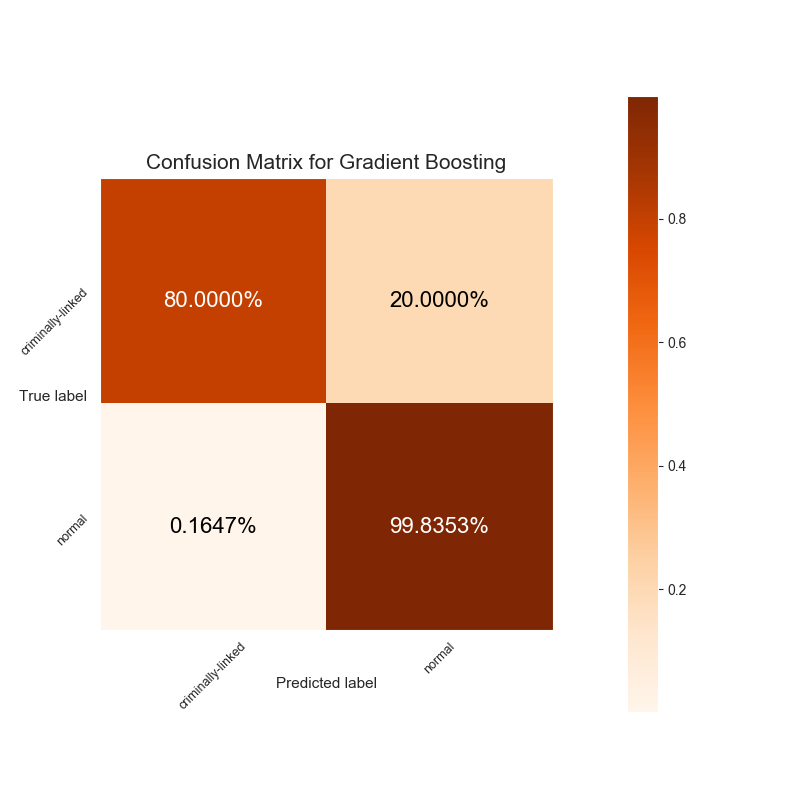
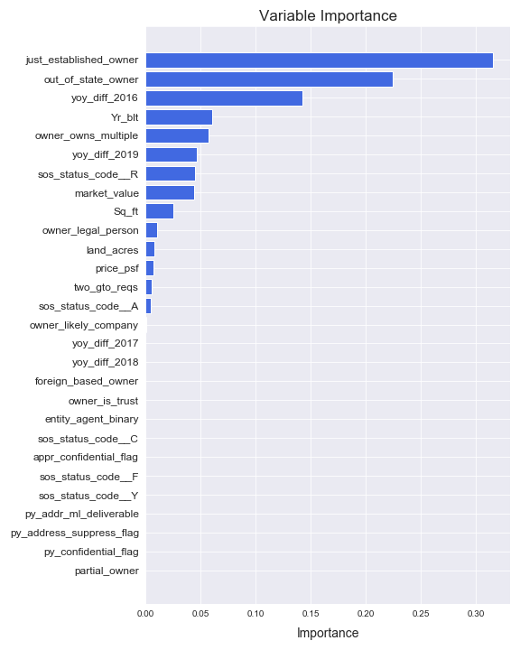
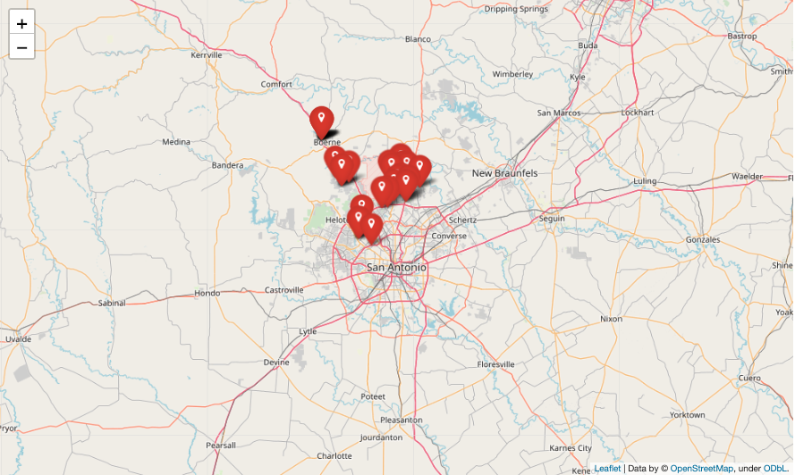

## Detecting Criminal Investment in Residential Property in Bexar County, Texas

<p align="center">
  
</p>

__Performance metrics for Gradient Boosting classifier trained on pseudo-labeled data on original test data:__
- Recall: 0.8
- Precision: 0.8
- F1 Score: 0.8

<p align="center">
  
</p>


A [Dutch study](https://www.politieacademie.nl/kennisenonderzoek/kennis/mediatheek/PDF/86218.pdf) that largely served as inspiration for this project found the three best indicators to identify conspicuous properties in the Netherlands are foreign ownership, the owner being a just-established company, and unusual price fluctuations. Therefore, my model having `just_established_owner` as the most important feature matches their study exactly.

Also encouraging is my model having year-over-year price differences for two years as some of the most important features. This roughly aligns with their third indicator of unusual price fluctuations.

Next, `out_of_state_owner` roughly maps to foreign ownership in the Dutch case.

Lastly, `owner_own_multiple` fits the general typology of money laundering in real estate where someone would own more than one property to launder larger amounts of money.


## About:

Money-laundering in residential real estate has become a significant focus of the United States Treasury's Financial Crimes Enforcement Network (FinCEN) over the past few years. As a part of this focus, FinCEN has begun releasing Geographic Targeting Orders (GTOs) that make title insurance companies legally obligated to report a real estate transaction if it meets specific criteria. These GTOs are applied at the county level, including such counties as Miami-Dade, Dallas, and Los Angeles. One county covered by a GTO that has always interested me is Bexar County, Texas, the county that surrounds San Antonio. Under a GTO since July 2016, Bexar County and San Antonio have a long history of ties to northern Mexico, with weekend commutes between San Antonio and Monterrey commonplace. The county has also recently had several high-profile instances of Mexican politicians stashing ill-gotten gains in real estate around San Antonio.

Therefore, focusing on Bexar County, I used publicly available data from the county property assessor and the state of Texas to build a model capable of detecting criminal investment in residential real estate in the county. This repository visualizes the data and applies unsupervised and semi-supervised approaches to detecting criminal investment.

## Contents:

- **data**:
  - raw_h5_files/bexar_property_all.h5 - 2019 Bexar County Appraisal District data with appraisal values from 2015, 2016, 2017, and 2018 added.
  - raw_h5_files/texas_corp_merged.h5 - State of Texas Comptroller of Public Accounts company data merged with the Comptroller's dataset that includes company directors and officers.
  - labels/criminal_properties_labels.csv - Dataset of properties located in Bexar County that have been used to launder the proceeds of some form of crime.

    One such example is 1115 Links Cv, San Antonio, TX 78260, which is owned by Red Kaizen Investments LLC. Red Kaizen Investments LLC is one of dozens of companies named as defendants in the court case against Rafael Olvera Amezcua, a Mexican financier accused of running a sham savings and loans business that defrauded depositors of more than $160 million.
  - figures - HTML output of plotted addresses of labeled properties from folium.
  <p align="center">
    
  </p>


- **build**:
  - build/merge.py - Script that joins the relevant columns from the Comptroller dataset with the cleaned Bexar property data. The output is a preprocessed h5 file.
  - build/process.py - Script that generates features for modeling and joins the labeled properties data. The output is a processed h5 file.
  - build/get_true_labels.py - Script that reduces the dataset to properties that I can confidently label as either "innocent" or "criminal" (see above for the "criminal" label). Output is h5 file.

      In order to build an adequately-large (several thousand) set of "innocent" properties, I assumed that every property owned by one of the top-30 most frequent owners would be innocent. I felt comfortable making that assumption because most of these owners are home builder companies and government agencies. There is, however, an obvious skew that this subset will have - newer properties as well as atypical housing that the county or city of San Antonio may own.

- **modeling_scripts**:
  - clustering.py - Script that visualizes clusters in the property data.
  - isolation_forest.py - Script that applies the Isolation Forest anomaly detection
algorithm to the property data and then returns visualizations and
model performance metrics.
  - semisupervised_pseudolabeling.py - Script that uses pseudo-labeling to train a semisupervised Gradient Boosting model. Outputs model metrics and confusion matrix visualization.

- **notebooks**:
  - Bexar_EDA.ipynb - Notebook for visual inspection of the data.
  - clustering.ipynb - Notebook that applies several unsupervised learning techniques to the data to reveal clusters.
  - isolation_forest.ipynb - Notebook that applies the Isolation Forest anomaly detection algorithm to the property data. I also used my experience in the field to trim the dataset to what I believed to be the most important features and applied the algorithm to this subset.
  - semisupervised_pseudolabeling.ipynb - Because I have a limited dataset of properties with labels I can be truly confident in, I used pseudo-labeling to train a Gradient Boosting Classifier.


- **configs**:
  - config.yaml - Contains variables for .py scripts

## Setup

1. Clone repository.
2. Go to <a href="https://drive.google.com/drive/folders/16hbhfiExi2Nf6zO56Dzl_28kw2cKKsB0?usp=sharing" target="_blank">this Google Drive link</a> to download the raw datasets for both Bexar Property and the Texas Comptroller.
3. Select "Download All" in the upper righthand corner. This will download a zip file.
4. Unzip the zip file and move the resulting "raw_h5_files" folder to this repo under the data folder. The two files will, together, be ~750 MB in size.
5. Install pipenv (if not already installed) and create a new environment with the requisite packages:
```
brew install pipenv
pipenv install
pipenv shell
```
6. Merge the two raw datasets into a preprocessed file:
```
python build/merge.py
```
7. Build the features used for modeling:
```
python build/process.py
```
8. Create dataset with true labels:
```
python build/get_true_labels.py
```

## Build Model


```
python modeling_scripts/clustering.py
python modeling_scripts/isolation_forest.py
python modeling_scripts/semisupervised_pseudolabeling.py
```

## Future Directions

- Train a GAN model for better semisupervised learning.
- Visualize with Streamlit.
- Add more features, such as Zillow neighborhood ratings, that have proven useful in other similar exercises.

## Changelog

##### branch==dev3 20200418
###### Added
- Figures for top ten features as well as bar chart for metrics comparison

##### branch==dev3 20200415
###### Changed
- Figures to reflect new performance metrics
- README overview to reflect reworked feature importances and metrics

##### branch==dev3 20200414
###### Added
- Grid-searched base model for pseudo-labeling
- New model in models/ folder

##### branch==dev2 20200326
###### Added
- Feature importance plot for GBC.
- Output feature importance plot for ssl .py script.
- New feature importance visualization

##### branch==dev2 20200325
###### Added
- Grid-searching for gradient boosting classifier in ssl notebook.
- GBC model saved under models folder.
- Figure with performance metrics for the grid-searched model.

###### Changed
- Second gradient boosting model to include grid-searched parameters.

###### Removed
- Figure with old performance metrics.
