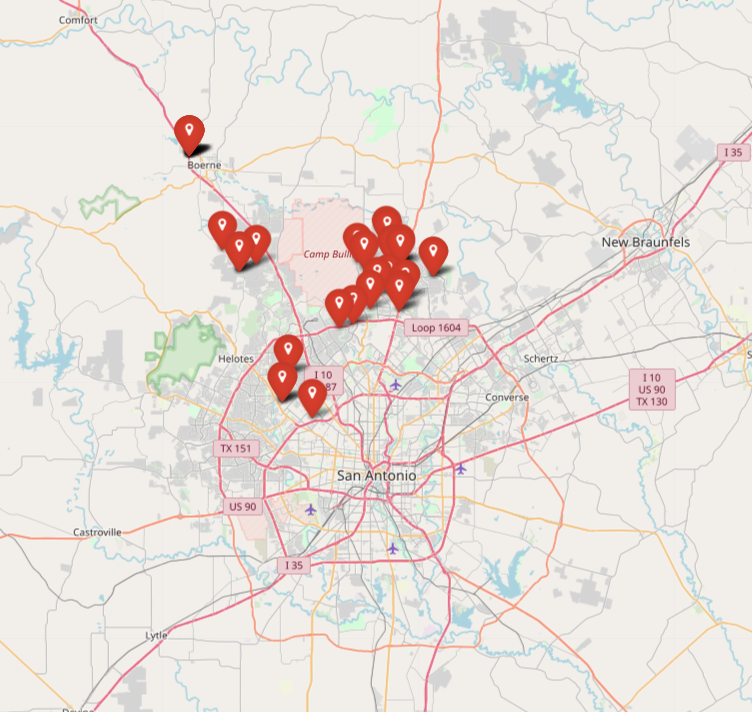

# Detecting Criminal Investment in Residential Property


## Contents:

- **data**:
  - raw_h5_files/bexar_property_all.h5 - 2019 Bexar County Appraisal District data with appraisal values from 2015, 2016, 2017, and 2018 added.
  - raw_h5_files/texas_corp_merged.h5 - State of Texas Comptroller of Public Accounts company data merged with the Comptroller's dataset that includes company directors and officers.
  - labels/criminal_properties_labels.csv - Dataset of properties located in Bexar County that have been used to launder the proceeds of some form of crime.

    One such example is 1115 Links Cv, San Antonio, TX 78260, which is owned by Red Kaizen Investments LLC. Red Kaizen Investments LLC is one of dozens of companies named as defendants in the court case against Rafael Olvera Amezcua, a Mexican financier accused of running a sham savings and loans business that defrauded depositors of more than $160 million.
  - figures - HTML output of mapping addresses of labeled properties from folium.
  <p align="center">
    
  </p>


- **build**:
  - build/merge.py - Script that joins the relevant columns from the Comptroller dataset with the cleaned Bexar property data. The output is a preprocessed h5 file.
  - build/process.py - Script that generates features for modeling and joins the labeled properties data. The output is a processed h5 file.
  - build/get_true_labels.py - Script that reduces the dataset to properties that I can confidently label as either "innocent" or "criminal" (see above for the "criminal" label). Output is h5 file.

      In order to build an adequately-large (several thousand) set of "innocent" properties, I assumed that every property owned by one of the top-30 most frequent owners would be innocent. I felt comfortable making that assumption because most of these owners are home builder companies and government agencies. There is, however, an obvious skew that this subset will have - newer properties as well as atypical housing that the county or city of San Antonio may own.

- **configs**:
  - config.yaml - Contains variables for process.py

## Setup

1. Clone repository.
2. Go to <a href="https://drive.google.com/drive/folders/16hbhfiExi2Nf6zO56Dzl_28kw2cKKsB0?usp=sharing" target="_blank">this Google Drive link</a> to download the raw datasets for both Bexar Property and the Texas Comptroller.
3. Select "Download All" in the upper righthand corner. This will download a zip file.
4. Unzip the zip file and move the resulting "raw_h5_files" folder to this repo under the data folder. The two files will, together, be ~750 MB in size.
5. Create new conda environment with requisite package:
```
conda env create -f environment.yml
conda activate prop_env
```
6. Merge the two raw datasets into a preprocessed file:
```
python build/merge.py
```
7. Build the features used for modeling:
```
python build/process.py
```
8. Create dataset with true labels:
```
python build/get_true_labels.py
```

## Build Model

## Analysis
